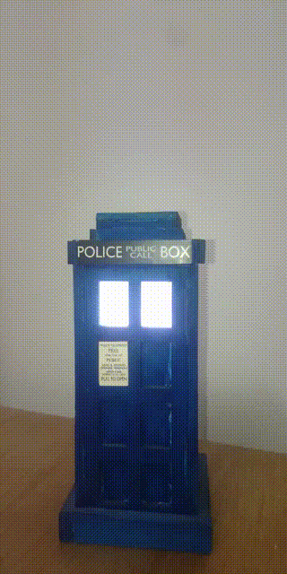

# stm32f030-tardislamp
stm32f030f4p6 ws2812 library using CubeMX HAL SPI



look at stm32f030-tardislamp.ioc file for SPI configurations.


## How to build
connect stlink/stlinkv2 to debug wire pins and
```
make
make flash
```
